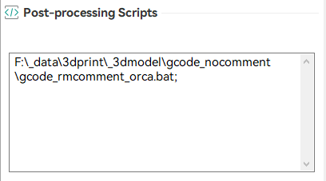
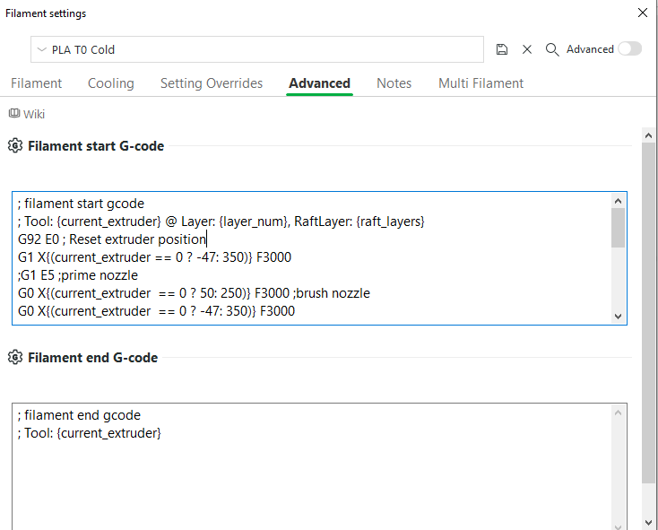
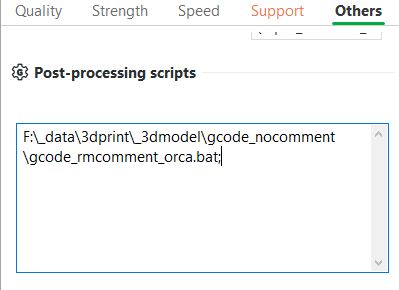

# Entina X40 Profiles
Entina X40 Weedo X40 Profiles for OrcaSlicer/BambuStudio/PrusaSlicer
-- kitedriver

## 1.Entina X40 - OrcaSlicer Profile

[Printer]

It use printer g-code to implement tool/filament change.

[Post Processing Script]

It use a batch script to remove all comment in the g-code file.

Please set Other -> Post-processing scripts to "gcode_rmcomment_orca.bat;"

and use the comment removed g-code file to upload to Wii-builder

## 2.Entina X40 - Bambu Studio Profile

[Printer]

The tool change is implemented in filament g-code to avoid "Access Violation" in Bambu Studio

[Tool Change/Filament Change]

It use Filament G-code to control tool change/filament instead of Printer G-code.

[Post Processing Script]

It use a batch script to remove all comment in the g-code file.

Please set Other -> Post-processing scripts to "gcode_rmcomment_orca.bat;"

and use the comment removed g-code file to upload to Wii-builder

## 3.Entina X40 - PrusaSlicer Profile

[Printer]

It use printer g-code to implement tool/filament change.

